<div align="center">
  <a href="https://github.com/brokermr810/QuantDinger">
    
  </a>

  <h1 align="center">QuantDinger</h1>

  <br/>
 
  <h3 align="center">
    Next-Gen AI Quantitative Trading Platform
  </h3>
  
  <p align="center">
    <strong>🤖 AI-Native · 🐍 Visual Python · 🌍 Multi-Market · 🔒 Privacy-First</strong>
  </p>
  <p align="center">
    <i>Build, Backtest, and Trade with an AI Co-Pilot. Better than PineScript, Smarter than SaaS.</i>
  </p>

  <p align="center">
  <a href="https://www.quantdinger.com"><strong>Official Community</strong></a> ·
  <a href="https://ai.quantdinger.com"><strong>Live Demo</strong></a> ·
  <a href="https://youtu.be/HPTVpqL7knM"><strong>📺 Video Demo</strong></a> ·
  <a href="CONTRIBUTORS.md"><strong>🌟 Join Us</strong></a>
  </p>

  <p align="center">
    <a href="LICENSE"></a>
    
    
    
    
  </p>

  <p align="center">
    <a href="https://t.me/quantdinger"></a>
    <a href="https://discord.gg/tyx5B6TChr"></a>
    <a href="https://x.com/HenryCryption"></a>
  </p>

  <p align="center">
    
    
    
    
    
    
    
    
    
    
  </p>
</div>

---

## 📑 Table of Contents

- [🚀 Quick Start (2 Minutes)](#-quick-start-2-minutes)
- [📖 Introduction](#-introduction)
- [📸 Visual Tour](#-visual-tour)
- [✨ Key Features](#-key-features)
- [🔌 Supported Exchanges & Brokers](#-supported-exchanges--brokers)
- [🏗️ Architecture & Configuration](#️-architecture--configuration)
- [📚 Documentation Index](#-documentation-index)
- [💼 License & Commercial](#-license--commercial)
- [🤝 Community & Support](#-community--support)

---

## 🚀 Quick Start (2 Minutes)

> **Only need**: [Docker](https://docs.docker.com/get-docker/) installed. Nothing else.

```bash
# 1. Clone
git clone https://github.com/brokermr810/QuantDinger.git
cd QuantDinger

# 2. Configure (edit admin password & AI API key)
cp backend_api_python/env.example backend_api_python/.env

# 3. Launch!
docker-compose up -d --build
```

> **Windows PowerShell**: use `Copy-Item backend_api_python\env.example -Destination backend_api_python\.env`

🎉 **Done!** Open **http://localhost:8888** | Login: `quantdinger` / `123456`

<details>
<summary><b>📝 Key settings in backend_api_python/.env</b></summary>

```ini
# Required — Change for production!
ADMIN_USER=quantdinger
ADMIN_PASSWORD=your_secure_password
SECRET_KEY=your_random_secret_key

# Optional — Enable AI features (pick one)
OPENROUTER_API_KEY=your_key        # Recommended: 100+ models
OPENAI_API_KEY=your_key            # GPT-4o
DEEPSEEK_API_KEY=your_key          # Cost-effective
GOOGLE_GEMINI_API_KEY=your_key     # Gemini
```

</details>

<details>
<summary><b>🔧 Common Docker Commands</b></summary>

```bash
docker-compose ps                  # View service status
docker-compose logs -f backend     # View backend logs (real-time)
docker-compose restart backend     # Restart backend only
docker-compose up -d --build       # Rebuild & restart all
docker-compose down                # Stop all services
```

**Update to latest version:**
```bash
git pull && docker-compose up -d --build
```

**Backup & Restore database:**
```bash
docker exec quantdinger-db pg_dump -U quantdinger quantdinger > backup.sql
cat backup.sql | docker exec -i quantdinger-db psql -U quantdinger quantdinger
```

**Custom port** — create `.env` in project root:
```ini
FRONTEND_PORT=3000          # Default: 8888
BACKEND_PORT=127.0.0.1:5001 # Default: 5000
```

</details>

---

## 📖 Introduction

**QuantDinger** is a **self-hosted, privacy-first AI quantitative trading platform**. Your strategies, API keys, and trading data stay on **your own machine** — not in someone else's cloud.

| | |
|---|---|
| 🔒 **Privacy-First** | Your API keys, strategies, and data never leave your server |
| 🐍 **Python-Native** | Write indicators in Python, visualize on K-line charts with AI assistance |
| 🤖 **AI Co-Pilot** | Multi-agent analysis, backtest optimization, trading radar |
| 🌍 **Multi-Market** | Crypto (10+ exchanges), US Stocks (IBKR), Forex (MT5) |
| 💳 **Monetization-Ready** | Membership, credits, USDT on-chain payment — all built-in |
| ⚡ **One-Click Deploy** | `docker-compose up -d` — production-ready in 2 minutes |

---

## 📺 Video Demo

<div align="center">
  <a href="https://youtu.be/HPTVpqL7knM">
    
  </a>
  <p><strong>▶️ Click to watch the full project introduction</strong></p>
</div>

---

## 📸 Visual Tour

<div align="center">
  <h3>🗺️ System Architecture Overview</h3>
  
</div>

<br/>

<div align="center">
  <h3>📊 Professional Quant Dashboard</h3>
  
</div>

<br/>

<table align="center" width="100%">
  <tr>
    <td width="50%" align="center" valign="top">
      <h3>🤖 AI Deep Research</h3>
      <p>Multi-agent market sentiment & technical analysis</p>
      
    </td>
    <td width="50%" align="center" valign="top">
      <h3>💬 Smart Trading Assistant</h3>
      <p>Natural language interface for market insights</p>
      
    </td>
  </tr>
  <tr>
    <td width="50%" align="center" valign="top">
      <h3>📈 Indicator Analysis</h3>
      <p>Technical indicators with drag-and-drop</p>
      
    </td>
    <td width="50%" align="center" valign="top">
      <h3>🐍 AI Strategy Coding</h3>
      <p>AI-assisted Python strategy generation</p>
      
    </td>
  </tr>
  <tr>
    <td colspan="2" align="center" valign="top">
      <h3>📊 Portfolio Monitor</h3>
      <p>Track positions, set alerts, AI-powered analysis via Email/Telegram</p>
      
    </td>
  </tr>
</table>

---

## ✨ Key Features

### 🐍 Visual Python Strategy Workbench

Write indicators in **Python** (not PineScript), run them on built-in K-line charts, and let AI write the complex logic for you. Full Python ecosystem: Pandas, Numpy, TA-Lib.

### 📈 Complete Trading Lifecycle

**Indicator → Strategy → Backtest → AI Optimize → Live Trade / Signal Notify**

- Simplified strategy creation with smart defaults (15min K-line, 5x leverage, market order)
- AI analyzes backtest results and suggests parameter improvements
- Live trading on Crypto (10+ exchanges), US Stocks (IBKR), Forex (MT5)
- Signal notifications via Telegram, Discord, Email, SMS, Webhook

### 🤖 AI-Powered Analysis

- **Multi-Agent Analysis**: 5 parallel analysts + bull/bear debate + final trading decision
- **AI Trading Radar**: Auto-scans Crypto/Stocks/Forex markets hourly
- **Quick Trade Panel (⚡)**: One-click trade from any analysis signal
- **Memory-Augmented**: RAG-style local memory — agents learn from past analyses

### 💳 Built-in Monetization

- **Membership Plans**: Monthly / Yearly / Lifetime with credits
- **USDT On-Chain Payment**: TRC20 scan-to-pay, HD Wallet address derivation, auto-reconciliation
- **Indicator Marketplace**: Publish, buy, and sell Python indicators with credits

### 🔐 User Management & Security

- Multi-user with PostgreSQL, role-based permissions
- Google & GitHub OAuth, email verification
- Cloudflare Turnstile captcha, rate limiting, demo mode

### 🧠 Multi-LLM Support

| Provider | Models |
|----------|--------|
| **OpenRouter** | 100+ models (recommended) |
| **OpenAI** | GPT-4o, GPT-4o-mini |
| **Google Gemini** | Gemini 1.5 Flash/Pro |
| **DeepSeek** | DeepSeek Chat |
| **xAI Grok** | Grok Beta |

```mermaid
flowchart TB
    subgraph Entry["🌐 API Entry"]
        A["📡 POST /api/analysis/multi"]
        A2["🔄 POST /api/analysis/reflect"]
    end
    subgraph Service["⚙️ Service Orchestration"]
        B[AnalysisService]
        C[AgentCoordinator]
        D["📊 Build Context<br/>price · kline · news · indicators"]
    end
    subgraph Agents["🤖 Multi-Agent Workflow"]
        subgraph P1["📈 Phase 1 · Analysis (Parallel)"]
            E1["🔍 MarketAnalyst"]
            E2["📑 FundamentalAnalyst"]
            E3["📰 NewsAnalyst"]
            E4["💭 SentimentAnalyst"]
            E5["⚠️ RiskAnalyst"]
        end
        subgraph P2["🎯 Phase 2 · Debate"]
            F1["🐂 BullResearcher"]
            F2["🐻 BearResearcher"]
        end
        subgraph P3["💹 Phase 3 · Decision"]
            G["🎰 TraderAgent → BUY / SELL / HOLD"]
        end
    end
    subgraph Memory["🧠 PostgreSQL Memory Store"]
        M1[("agent memories")]
    end
    subgraph Reflect["🔄 Reflection Loop"]
        R[ReflectionService]
        W["⏰ ReflectionWorker"]
    end
    A --> B --> C --> D
    D --> P1 --> P2 --> P3
    Agents <-.-> M1
    C --> R
    W -.->|"verify + learn"| M1
```

<details>
<summary><b>🔄 Memory-Augmented Agent Architecture (Click to expand)</b></summary>



</details>

---

## 🔌 Supported Exchanges & Brokers

### Cryptocurrency (Direct API Trading)

| Exchange | Markets |
|:--------:|:---------|
| Binance | Spot, Futures, Margin |
| OKX | Spot, Perpetual, Options |
| Bitget | Spot, Futures, Copy Trading |
| Bybit | Spot, Linear Futures |
| Coinbase | Spot |
| Kraken | Spot, Futures |
| KuCoin | Spot, Futures |
| Gate.io | Spot, Futures |
| Bitfinex | Spot, Derivatives |

### Traditional Brokers & Markets

| Market | Broker/Source | Trading |
|--------|--------------|---------|
| **US Stocks** | Interactive Brokers (IBKR), Yahoo Finance, Finnhub | ✅ Via IBKR |
| **Forex** | MetaTrader 5 (MT5), OANDA | ✅ Via MT5 |
| **Futures** | Exchange APIs | ⚡ Data + Notify |

---

## 🏗️ Architecture & Configuration

```text
┌─────────────────────────────────────┐
│         Docker Compose              │
│                                     │
│  ┌───────────────────────────────┐  │
│  │  frontend (Nginx)  → :8888   │  │
│  └──────────────┬────────────────┘  │
│                 │ /api/* proxy       │
│  ┌──────────────▼────────────────┐  │
│  │  backend (Flask)   → :5000   │  │
│  └──────────────┬────────────────┘  │
│  ┌──────────────▼────────────────┐  │
│  │  postgres (PG 16)  → :5432   │  │
│  └───────────────────────────────┘  │
│                                     │
│  External: LLM APIs · Exchanges ·   │
│  TronGrid · Data providers          │
└─────────────────────────────────────┘
```

### Repository Layout

```text
QuantDinger/
├── backend_api_python/          # 🐍 Backend (Open Source, Apache 2.0)
│   ├── app/routes/              #   API endpoints
│   ├── app/services/            #   Business logic (AI, trading, payment)
│   ├── migrations/init.sql      #   Database schema
│   ├── env.example              #   ⚙️ Config template → copy to .env
│   └── Dockerfile
├── frontend/                    # 🎨 Frontend (Pre-built)
│   ├── dist/                    #   Static files (HTML/JS/CSS)
│   ├── Dockerfile               #   Nginx image
│   └── nginx.conf               #   SPA routing + API proxy
├── docs/                        # 📚 Guides & tutorials
├── docker-compose.yml           # 🐳 One-click deployment
└── LICENSE                      # Apache 2.0
```

<details>
<summary><b>⚙️ Configuration Reference (.env)</b></summary>

Use `backend_api_python/env.example` as template:

| Category | Key Variables |
|----------|-----------|
| **Auth** | `SECRET_KEY`, `ADMIN_USER`, `ADMIN_PASSWORD` |
| **Database** | `DATABASE_URL` (PostgreSQL connection string) |
| **AI / LLM** | `LLM_PROVIDER`, `OPENROUTER_API_KEY`, `OPENAI_API_KEY` |
| **OAuth** | `GOOGLE_CLIENT_ID`, `GITHUB_CLIENT_ID` |
| **Security** | `TURNSTILE_SITE_KEY`, `ENABLE_REGISTRATION` |
| **Membership** | `MEMBERSHIP_MONTHLY_PRICE_USD`, `MEMBERSHIP_MONTHLY_CREDITS` |
| **USDT Payment** | `USDT_PAY_ENABLED`, `USDT_TRC20_XPUB`, `TRONGRID_API_KEY` |
| **Proxy** | `PROXY_PORT` or `PROXY_URL` |
| **Workers** | `ENABLE_PENDING_ORDER_WORKER`, `ENABLE_PORTFOLIO_MONITOR` |

</details>

<details>
<summary><b>🔌 API Endpoints</b></summary>

| Endpoint | Description |
|----------|-------------|
| `GET /api/health` | Health check |
| `POST /api/user/login` | User authentication |
| `GET /api/user/info` | Current user info |
| `GET /api/billing/plans` | Membership plans |
| `POST /api/billing/usdt/create-order` | Create USDT payment order |

For the full route list, see `backend_api_python/app/routes/`.

</details>

---

## 📚 Documentation Index

All detailed guides are in the [`docs/`](docs/) folder:

### Getting Started

| Document | Description |
|----------|-------------|
| [Changelog](docs/CHANGELOG.md) | Version history & migration notes |
| [Multi-User Setup](docs/multi-user-setup.md) | PostgreSQL multi-user deployment |

### Strategy Development

| Guide | 🇺🇸 EN | 🇨🇳 CN | 🇹🇼 TW | 🇯🇵 JA | 🇰🇷 KO |
|-------|--------|--------|--------|--------|--------|
| **Strategy Dev** | [EN](docs/STRATEGY_DEV_GUIDE.md) | [CN](docs/STRATEGY_DEV_GUIDE_CN.md) | [TW](docs/STRATEGY_DEV_GUIDE_TW.md) | [JA](docs/STRATEGY_DEV_GUIDE_JA.md) | [KO](docs/STRATEGY_DEV_GUIDE_KO.md) |
| **Cross-Sectional** | [EN](docs/CROSS_SECTIONAL_STRATEGY_GUIDE_EN.md) | [CN](docs/CROSS_SECTIONAL_STRATEGY_GUIDE_CN.md) | | | |
| **Code Examples** | [examples/](docs/examples/) | | | | |

### Broker & Integration

| Guide | English | 中文 |
|-------|---------|------|
| **IBKR (US Stocks)** | [Guide](docs/IBKR_TRADING_GUIDE_EN.md) | — |
| **MT5 (Forex)** | [Guide](docs/MT5_TRADING_GUIDE_EN.md) | [指南](docs/MT5_TRADING_GUIDE_CN.md) |
| **OAuth (Google/GitHub)** | [Guide](docs/OAUTH_CONFIG_EN.md) | [指南](docs/OAUTH_CONFIG_CN.md) |

### Notifications

| Channel | English | 中文 |
|---------|---------|------|
| **Telegram** | [Setup](docs/NOTIFICATION_TELEGRAM_CONFIG_EN.md) | [配置](docs/NOTIFICATION_TELEGRAM_CONFIG_CH.md) |
| **Email (SMTP)** | [Setup](docs/NOTIFICATION_EMAIL_CONFIG_EN.md) | [配置](docs/NOTIFICATION_EMAIL_CONFIG_CH.md) |
| **SMS (Twilio)** | [Setup](docs/NOTIFICATION_SMS_CONFIG_EN.md) | [配置](docs/NOTIFICATION_SMS_CONFIG_CH.md) |

---

## 💼 License & Commercial

### Open Source License

Backend source code is licensed under **Apache License 2.0**. See `LICENSE`.

The frontend UI is provided as **pre-built files**. Trademark rights (name/logo/branding) are governed separately — see `TRADEMARKS.md`.

### 🎓 Free Source Code for Non-Profit & Education

If you are a **university**, **research institution**, **non-profit**, **community group**, or **educational program**, you can apply for **free authorization and full frontend source code**:

- 🏫 Universities & academic research
- 🌍 Open-source communities & developer groups
- 🤝 Non-profit & public welfare organizations
- 📚 Educational programs & student hackathons

### 💼 Commercial License

For **commercial use**, purchase a license to get:

- **Full frontend source code** + future updates
- **Branding authorization** — modify name/logo/copyright as agreed
- **Operations support** — deployment, upgrades, incident response
- **Consulting** — architecture review, performance tuning

### 📬 Contact

| Channel | Link |
|---------|------|
| **Telegram** | [t.me/worldinbroker](https://t.me/worldinbroker) |
| **Email** | [brokermr810@gmail.com](mailto:brokermr810@gmail.com) |

---

## 🤝 Community & Support

<p>
  <a href="https://t.me/quantdinger"></a>
  <a href="https://discord.gg/tyx5B6TChr"></a>
  <a href="https://youtube.com/@quantdinger"></a>
</p>

- [Contributing Guide](CONTRIBUTING.md) · [Contributors](CONTRIBUTORS.md)
- [Report Bugs / Request Features](https://github.com/brokermr810/QuantDinger/issues)
- Email: [brokermr810@gmail.com](mailto:brokermr810@gmail.com)

---

### 💝 Support the Project

**Crypto Donations (ERC-20 / BEP-20 / Polygon / Arbitrum)**

```
0x96fa4962181bea077f8c7240efe46afbe73641a7
```

<p>
  
  
</p>

---

### 🎓 Supporting Partners

<div align="center">
<table>
  <tr>
    <td align="center" width="50%">
      <a href="https://beinvolved.indiana.edu/organization/quantfiniu" target="_blank">
        
      </a>
      <br/><br/>
      <strong>Quantitative Finance Society (QFS)</strong><br/>
      <small>Indiana University Bloomington</small>
    </td>
  </tr>
</table>
</div>

> 💡 **Want to become a partner?** Contact [brokermr810@gmail.com](mailto:brokermr810@gmail.com) or [Telegram](https://t.me/worldinbroker).

---

### Acknowledgements

| Project | Link |
|---------|------|
| Flask | [flask.palletsprojects.com](https://flask.palletsprojects.com/) |
| Pandas | [pandas.pydata.org](https://pandas.pydata.org/) |
| CCXT | [github.com/ccxt/ccxt](https://github.com/ccxt/ccxt) |
| yfinance | [github.com/ranaroussi/yfinance](https://github.com/ranaroussi/yfinance) |
| Vue.js | [vuejs.org](https://vuejs.org/) |
| Ant Design Vue | [antdv.com](https://antdv.com/) |
| KlineCharts | [github.com/klinecharts/KLineChart](https://github.com/klinecharts/KLineChart) |
| ECharts | [echarts.apache.org](https://echarts.apache.org/) |

Thanks to all maintainers and contributors! ❤️
