<div align="center">
  <a href="https://github.com/brokermr810/QuantDinger">
    
  </a>

  <h1 align="center">QuantDinger</h1>

  <br/>
 
  <h3 align="center">
    Next-Gen AI Quantitative Trading Platform
  </h3>
  
  <p align="center">
    <strong>🤖 AI-Native · 🐍 Visual Python · 🌍 Multi-Market · 🔒 Privacy-First</strong>
  </p>
  <p align="center">
    <i>Build, Backtest, and Trade with an AI Co-Pilot. Better than PineScript, Smarter than SaaS.</i>
  </p>

  <p align="center">
  <a href="https://www.quantdinger.com"><strong>Official Community</strong></a> ·
  <a href="https://ai.quantdinger.com"><strong>Live Demo</strong></a> ·
  <a href="https://youtu.be/HPTVpqL7knM"><strong>📺 Video Demo</strong></a> ·
  <a href="CONTRIBUTORS.md"><strong>🌟 Join Us</strong></a>
  </p>

  <p align="center">
    <a href="LICENSE"></a>
    
    
    
    
  </p>

  <p align="center">
    <a href="https://t.me/quantdinger"></a>
    <a href="https://discord.gg/tyx5B6TChr"></a>
    <a href="https://x.com/HenryCryption"></a>
  </p>
</div>

---

## 📖 Introduction

### What is QuantDinger?

QuantDinger is a **local-first, privacy-first, self-hosted quantitative trading infrastructure**. It runs on your own machine/server, providing **multi-user accounts backed by PostgreSQL** while keeping full control of your strategies, trading data, and API keys.

### Why Local-First?

Unlike SaaS platforms that lock your data and strategies in the cloud, QuantDinger runs locally. Your strategies, trading logs, API keys, and analysis results stay on your machine. No vendor lock-in, no data exfiltration.

### Who is this for?

QuantDinger is built for traders, researchers, and engineers who:
- Value data sovereignty and privacy
- Want transparent, auditable trading infrastructure
- Prefer engineering over marketing
- Need a complete workflow: data, analysis, backtesting, and execution

### Core Value

- **🔓 Apache 2.0 Open Source (Backend)**: Permissive and commercial-friendly
- **🐍 Python-Native & Visual**: Write indicators in Python with AI assistance, visualize on built-in K-line charts
- **🤖 AI-Loop Optimization**: AI analyzes backtest results to suggest parameter tuning, forming a closed optimization loop
- **🌍 Universal Market Access**: Crypto (Live), US Stocks (IBKR), Forex (MT5), Futures (Data/Notify)
- **💳 Built-in Monetization**: Membership subscription, credit system, USDT on-chain payment
- **⚡ Docker One-Click Deploy**: `docker-compose up -d` — zero dependency, zero build, production-ready in 2 minutes

---

## 📺 Video Demo

<div align="center">
  <a href="https://youtu.be/HPTVpqL7knM">
    
  </a>
  <p><strong>Click the video above to watch the QuantDinger project introduction</strong></p>
</div>

---

## 📚 Documentation Index

All detailed guides and tutorials are in the [`docs/`](docs/) folder. Click any link below to jump directly.

### 📋 General

| Document | Description |
|----------|-------------|
| [Changelog](docs/CHANGELOG.md) | Version history, new features, bug fixes, and migration notes |
| [Multi-User Setup](docs/multi-user-setup.md) | PostgreSQL-based multi-user deployment guide |

### 🐍 Strategy Development

| Document | Language |
|----------|----------|
| [Strategy Development Guide](docs/STRATEGY_DEV_GUIDE.md) | 🇺🇸 English |
| [策略开发指南](docs/STRATEGY_DEV_GUIDE_CN.md) | 🇨🇳 简体中文 |
| [策略開發指南](docs/STRATEGY_DEV_GUIDE_TW.md) | 🇹🇼 繁體中文 |
| [ストラテジー開発ガイド](docs/STRATEGY_DEV_GUIDE_JA.md) | 🇯🇵 日本語 |
| [전략 개발 가이드](docs/STRATEGY_DEV_GUIDE_KO.md) | 🇰🇷 한국어 |

### 📈 Cross-Sectional Strategy

| Document | Language |
|----------|----------|
| [Cross-Sectional Strategy Guide](docs/CROSS_SECTIONAL_STRATEGY_GUIDE_EN.md) | 🇺🇸 English |
| [截面策略开发指南](docs/CROSS_SECTIONAL_STRATEGY_GUIDE_CN.md) | 🇨🇳 简体中文 |

### 🏦 Broker Integration

| Document | Description |
|----------|-------------|
| [IBKR Trading Guide](docs/IBKR_TRADING_GUIDE_EN.md) | Interactive Brokers (US Stocks) integration |
| [MT5 Trading Guide (EN)](docs/MT5_TRADING_GUIDE_EN.md) | MetaTrader 5 (Forex) integration — English |
| [MT5 交易指南 (CN)](docs/MT5_TRADING_GUIDE_CN.md) | MetaTrader 5 (Forex) 集成指南 — 中文 |

### 🔐 OAuth Configuration

| Document | Language |
|----------|----------|
| [OAuth Configuration (EN)](docs/OAUTH_CONFIG_EN.md) | 🇺🇸 Google & GitHub OAuth setup |
| [OAuth 配置指南 (CN)](docs/OAUTH_CONFIG_CN.md) | 🇨🇳 Google & GitHub OAuth 配置 |

### 🔔 Notification Configuration

| Channel | English | 中文 |
|---------|---------|------|
| **Telegram** | [Setup Guide](docs/NOTIFICATION_TELEGRAM_CONFIG_EN.md) | [配置指南](docs/NOTIFICATION_TELEGRAM_CONFIG_CH.md) |
| **Email (SMTP)** | [Setup Guide](docs/NOTIFICATION_EMAIL_CONFIG_EN.md) | [配置指南](docs/NOTIFICATION_EMAIL_CONFIG_CH.md) |
| **SMS (Twilio)** | [Setup Guide](docs/NOTIFICATION_SMS_CONFIG_EN.md) | [配置指南](docs/NOTIFICATION_SMS_CONFIG_CH.md) |

### 💻 Code Examples

| File | Description |
|------|-------------|
| [docs/examples/](docs/examples/) | Python strategy code examples and templates |

---

## 📸 Visual Tour

<div align="center">
  <h3>🗺️ System Architecture Overview</h3>
  <p>A comprehensive view of QuantDinger's AI-powered research, backtesting, and automated trading capabilities.</p>
  
</div>

<br/>

<div align="center">
  <h3>📊 Professional Quant Dashboard</h3>
  <p>Real-time monitoring of market dynamics, assets, and strategy status.</p>
  
</div>

<br/>

<table align="center" width="100%">
  <tr>
    <td width="50%" align="center" valign="top">
      <h3>🤖 AI Deep Research</h3>
      <p>Multi-agent collaboration for market sentiment & technical analysis.</p>
      
    </td>
    <td width="50%" align="center" valign="top">
      <h3>💬 Smart Trading Assistant</h3>
      <p>Natural language interface for instant market insights.</p>
      
    </td>
  </tr>
  <tr>
    <td width="50%" align="center" valign="top">
      <h3>📈 Interactive Indicator Analysis</h3>
      <p>Rich library of technical indicators with drag-and-drop analysis.</p>
      
    </td>
    <td width="50%" align="center" valign="top">
      <h3>🐍 Python Strategy Gen</h3>
      <p>Built-in editor with AI-assisted strategy coding.</p>
      
    </td>
  </tr>
  <tr>
    <td colspan="2" align="center" valign="top">
      <h3>📊 Portfolio Monitor</h3>
      <p>Track positions, set alerts, and receive AI-powered analysis via Email/Telegram.</p>
      
    </td>
  </tr>
</table>

---

## ✨ Key Features

### 1. Visual Python Strategy Workbench
*Better than PineScript, Smarter than SaaS.*

- **Python Native**: Write indicators and strategies in Python. Leverage the entire Python ecosystem (Pandas, Numpy, TA-Lib) instead of proprietary languages like PineScript.
- **"Mini-TradingView" Experience**: Run your Python indicators directly on the built-in K-line charts. Visually debug buy/sell signals on historical data.
- **AI-Assisted Coding**: Let the built-in AI write the complex logic for you. From idea to code in seconds.

### 2. Complete Trading Lifecycle
*From Indicator to Execution, Seamlessly.*

1.  **Indicator**: Define your market entry/exit signals.
2.  **Strategy Config**: Simplified creation with smart defaults (15min K-line, 5x leverage, market order). Advanced mode available for full customization.
3.  **Backtest & AI Optimization**: Run backtests, view rich performance metrics, and **let AI analyze the result to suggest improvements**.
4.  **Execution Mode**:
    - **Live Trading**: 
      - **Cryptocurrency**: Direct API execution for 10+ exchanges (Binance, OKX, Bitget, Bybit, etc.)
      - **US Stocks**: Via Interactive Brokers (IBKR)
      - **Forex**: Via MetaTrader 5 (MT5)
    - **Signal Notification**: Send signals via Telegram, Discord, Email, SMS, or Webhook.
5.  **Risk Control**: Mandatory disclaimer acknowledgment before live trading. Market order mode by default for reliable execution.

### 3. AI-Powered Analysis & Trading Radar
*Fast, Accurate, Multi-Market Intelligence.*

- **Fast Analysis Mode**: Single LLM call architecture for quick, accurate analysis
- **AI Trading Opportunities Radar**: Auto-scans Crypto, US Stocks, and Forex markets every hour, displaying opportunities in a rolling carousel
- **Quick Trade Panel (⚡闪电交易)**: Side-sliding trade panel — see an AI signal or indicator opportunity, click "Trade Now" to instantly place an order without leaving the page. Supports market/limit orders, leverage, TP/SL price, and one-click position close.
- **ATR-Based Trading Levels**: Stop-loss and take-profit recommendations based on technical analysis
- **Analysis Memory**: Store analysis results for history review and continuous learning
- **Strategic Integration**: AI analysis can serve as a "Market Filter" for your strategies

### 4. Membership & Billing System
*Built-in Monetization for Deployment.*

- **Subscription Plans**: Monthly / Yearly / Lifetime tiers with configurable pricing
- **Credit System**: Each plan includes credits; lifetime members receive monthly credit bonuses
- **USDT On-Chain Payment** 💰: TRC20 scan-to-pay with HD Wallet (xpub) address derivation per order, automatic on-chain reconciliation via TronGrid API
- **Admin Configuration**: All plan prices, credits, and payment settings configurable via System Settings

### 5. Indicator Community & VIP System
*Share, Discover, and Trade Indicators.*

- **Publish & Share**: Share your Python indicators with the community
- **Credit-Based Purchase**: Buy premium indicators from other users with credits
- **VIP Free Indicators**: Mark indicators as "VIP Free" — VIP members can use them without spending credits
- **Rating & Reviews**: Rate and review purchased indicators
- **Live Performance Tracking**: Real-time performance stats aggregated from backtests and live trades

### 6. Universal Data Engine

QuantDinger provides a unified data interface across multiple markets:

- **Cryptocurrency**: Direct API connections for trading (10+ exchanges) and CCXT integration for market data (100+ sources)
- **Stocks**: Yahoo Finance, Finnhub, Tiingo (US stocks)
- **Futures/Forex**: OANDA and major futures data sources
- **Proxy Support**: Built-in proxy configuration for restricted network environments

### 7. Memory-Augmented Agents (Local RAG + Reflection Loop)

QuantDinger's agents don't start from scratch every time. The backend includes a **local memory store** and an optional **reflection/verification loop**:

- **What it is**: RAG-style experience retrieval injected into agent prompts (NOT model fine-tuning).
- **Where it lives**: PostgreSQL database (shared with main data) or local files under `backend_api_python/data/memory/` (privacy-first).

```mermaid
flowchart TB
    %% ===== 🌐 Entry Layer =====
    subgraph Entry["🌐 API Entry"]
        A["📡 POST /api/analysis/multi"]
        A2["🔄 POST /api/analysis/reflect"]
    end

    %% ===== ⚙️ Service Layer =====
    subgraph Service["⚙️ Service Orchestration"]
        B[AnalysisService]
        C[AgentCoordinator]
        D["📊 Build Context<br/>price · kline · news · indicators"]
    end

    %% ===== 🤖 Multi-Agent Workflow =====
    subgraph Agents["🤖 Multi-Agent Workflow"]

        subgraph P1["📈 Phase 1 · Analysis (Parallel)"]
            E1["🔍 MarketAnalyst<br/><i>Technical</i>"]
            E2["📑 FundamentalAnalyst<br/><i>Fundamentals</i>"]
            E3["📰 NewsAnalyst<br/><i>News & Events</i>"]
            E4["💭 SentimentAnalyst<br/><i>Market Mood</i>"]
            E5["⚠️ RiskAnalyst<br/><i>Risk Assessment</i>"]
        end

        subgraph P2["🎯 Phase 2 · Debate (Parallel)"]
            F1["🐂 BullResearcher<br/><i>Bullish Case</i>"]
            F2["🐻 BearResearcher<br/><i>Bearish Case</i>"]
        end

        subgraph P3["💹 Phase 3 · Decision"]
            G["🎰 TraderAgent<br/><i>Final Verdict → BUY / SELL / HOLD</i>"]
        end

    end

    %% ===== 🧠 Memory Layer =====
    subgraph Memory["🧠 PostgreSQL Memory Store"]
        M1[("market_analyst")]
        M2[("fundamental")]
        M3[("news_analyst")]
        M4[("sentiment")]
        M5[("risk_analyst")]
        M6[("bull_researcher")]
        M7[("bear_researcher")]
        M8[("trader_agent")]
    end

    %% ===== 🔄 Reflection Loop =====
    subgraph Reflect["🔄 Reflection Loop (Optional)"]
        R[ReflectionService]
        RR[("reflection_records.db")]
        W["⏰ ReflectionWorker"]
    end

    %% ===== Main Flow =====
    A --> B --> C --> D
    D --> P1 --> P2 --> P3

    %% ===== Memory Read/Write =====
    E1 <-.-> M1
    E2 <-.-> M2
    E3 <-.-> M3
    E4 <-.-> M4
    E5 <-.-> M5
    F1 <-.-> M6
    F2 <-.-> M7
    G <-.-> M8

    %% ===== Reflection Flow =====
    C --> R --> RR
    W --> RR
    W -.->|"verify + learn"| M8
    A2 -.->|"manual review"| M8
```



### 8. Multi-LLM Provider Support

| Provider | Features |
|----------|----------|
| **OpenRouter** | Multi-model gateway (default), 100+ models |
| **OpenAI** | GPT-4o, GPT-4o-mini |
| **Google Gemini** | Gemini 1.5 Flash/Pro |
| **DeepSeek** | DeepSeek Chat (cost-effective) |
| **xAI Grok** | Grok Beta |

Simply configure your preferred provider's API key in `.env`. The system auto-detects available providers.

### 9. User Management & Security

- **Multi-User Support**: PostgreSQL-backed user accounts with role-based permissions
- **OAuth Login**: Google and GitHub OAuth integration
- **Email Verification**: Registration and password reset via email codes
- **Security Features**: Cloudflare Turnstile captcha, IP/account rate limiting
- **Demo Mode**: Read-only mode for public demonstrations

### 10. Strategy Runtime

- **Thread-Based Executor**: Independent thread pool for strategy execution
- **Auto-Restore**: Resumes running strategies after system restarts
- **Market Order Default**: Prioritizes execution reliability over price optimization
- **Order Queue**: Background worker for order execution

### 11. Tech Stack

- **Backend**: Python (Flask) + PostgreSQL + Redis (optional)
- **Frontend**: Pre-built (Ant Design Vue + KlineCharts/ECharts)
- **Payment**: USDT TRC20 on-chain (HD Wallet xpub derivation + TronGrid API)
- **Mobile**: Vue 3 + Capacitor (Android / iOS) — see `QuantDinger-Mobile/`
- **Deployment**: Docker Compose (one-click, zero build)
- **Current Version**: V2.2.1 ([Changelog](docs/CHANGELOG.md))

---

## 🔌 Supported Exchanges & Brokers

### Cryptocurrency Exchanges (Direct API)

| Exchange | Markets |
|:--------:|:---------|
| Binance | Spot, Futures, Margin |
| OKX | Spot, Perpetual, Options |
| Bitget | Spot, Futures, Copy Trading |
| Bybit | Spot, Linear Futures |
| Coinbase Exchange | Spot |
| Kraken | Spot, Futures |
| KuCoin | Spot, Futures |
| Gate.io | Spot, Futures |
| Bitfinex | Spot, Derivatives |

### Traditional Brokers

| Broker | Markets | Platform |
|:------:|:--------|:---------|
| **Interactive Brokers (IBKR)** | US Stocks | TWS / IB Gateway |
| **MetaTrader 5 (MT5)** | Forex | MT5 Terminal |

### Supported Markets

| Market Type | Data Sources | Trading |
|-------------|--------------|---------|
| **Cryptocurrency** | Binance, OKX, Bitget, + 100 exchanges | ✅ Full support |
| **US Stocks** | Yahoo Finance, Finnhub, Tiingo | ✅ Via IBKR |
| **Forex** | Finnhub, OANDA | ✅ Via MT5 |
| **Futures** | Exchange APIs | ⚡ Data only |

---

### Multi-Language Support

<p>
  
  
  
  
  
  
  
  
  
  
</p>

All UI elements, error messages, and documentation are fully translated. Language is auto-detected based on browser settings or can be manually switched in the app.

---

## 🚀 Quick Start (Docker One-Click Deploy)

> **Prerequisites**: Docker & Docker Compose installed.  
> No Node.js, no Python environment needed — everything runs in containers.

### 1. Clone & Configure

```bash
git clone https://github.com/brokermr810/QuantDinger.git
cd QuantDinger
```

### 2. Set Up Environment

```bash
# Copy the environment template
cp backend_api_python/env.example backend_api_python/.env
```

> **Windows PowerShell**:
> ```powershell
> Copy-Item backend_api_python\env.example -Destination backend_api_python\.env
> ```

Edit `backend_api_python/.env` with your settings:

```ini
# Required — Change these for production!
ADMIN_USER=quantdinger
ADMIN_PASSWORD=your_secure_password
SECRET_KEY=your_random_secret_key

# Optional — Enable AI features
OPENROUTER_API_KEY=your_openrouter_key
# or
OPENAI_API_KEY=your_openai_key
```

### 3. Launch

```bash
docker-compose up -d --build
```

**That's it!** 🎉 Wait about 30 seconds for all services to start.

| Service | URL |
|---------|-----|
| **Frontend UI** | http://localhost:8888 |
| Backend API | http://localhost:5000 (internal) |
| PostgreSQL | localhost:5432 (internal) |

Default login: `quantdinger` / `123456` (change in `.env` for production).

### Common Docker Commands

```bash
docker-compose ps                  # View service status
docker-compose logs -f backend     # View backend logs (real-time)
docker-compose logs -f frontend    # View frontend/nginx logs
docker-compose restart backend     # Restart backend only
docker-compose up -d --build       # Rebuild & restart all
docker-compose down                # Stop all services
```

### Update to Latest Version

```bash
git pull
docker-compose up -d --build
```

### Backup & Restore

```bash
# Backup database
docker exec quantdinger-db pg_dump -U quantdinger quantdinger > backup_$(date +%Y%m%d).sql

# Restore database
cat backup.sql | docker exec -i quantdinger-db psql -U quantdinger quantdinger
```

### Custom Port

Create a `.env` file in the project root to override docker-compose defaults:

```ini
FRONTEND_PORT=3000          # Change frontend port (default: 8888)
BACKEND_PORT=127.0.0.1:5001 # Change backend port (default: 5000)
DB_PORT=127.0.0.1:5433      # Change database port (default: 5432)
```

---

## 🏗️ Architecture

```text
┌────────────────────────────────────────┐
│           Docker Compose               │
│                                        │
│  ┌──────────────────────────────────┐  │
│  │  frontend (Nginx)                │  │
│  │  Pre-built static files          │  │
│  │  → :8888                         │  │
│  └──────────────┬───────────────────┘  │
│                 │ /api/* proxy          │
│                 ▼                       │
│  ┌──────────────────────────────────┐  │
│  │  backend (Python/Flask)          │  │
│  │  API + AI + Strategy Runtime     │  │
│  │  → :5000                         │  │
│  └──────────────┬───────────────────┘  │
│                 │                       │
│  ┌──────────────▼───────────────────┐  │
│  │  postgres (PostgreSQL 16)        │  │
│  │  Users, Orders, Strategies, ...  │  │
│  │  → :5432                         │  │
│  └──────────────────────────────────┘  │
│                                        │
│  External connections:                 │
│  ├─ LLM APIs (OpenRouter/OpenAI/...)   │
│  ├─ Exchange APIs (Binance/OKX/...)    │
│  ├─ TronGrid API (USDT payment)       │
│  └─ Data providers (Yahoo/Finnhub/...) │
└────────────────────────────────────────┘
```

### Repository Layout

```text
QuantDinger/
├── backend_api_python/          # 🐍 Backend API (Open Source)
│   ├── app/
│   │   ├── routes/              #   API endpoints (user, billing, strategy, ...)
│   │   ├── services/            #   Business logic (trading, payment, AI, ...)
│   │   ├── data_sources/        #   Market data providers
│   │   └── utils/               #   Helpers (DB, auth, etc.)
│   ├── migrations/init.sql      #   Database schema
│   ├── env.example              #   ⚙️ Configuration template — copy to .env
│   ├── Dockerfile               #   Backend container image
│   └── run.py                   #   Entrypoint
│
├── frontend/                    # 🎨 Frontend (Pre-built)
│   ├── dist/                    #   Compiled static files (HTML/JS/CSS)
│   ├── Dockerfile               #   Nginx container image
│   ├── nginx.conf               #   Nginx config (SPA + API proxy)
│   └── VERSION                  #   Frontend version tracker
│
├── docs/                        # 📚 Documentation & Guides
│   ├── CHANGELOG.md             #   Version history
│   ├── screenshots/             #   UI screenshots
│   └── *.md                     #   Strategy, broker, notification guides
│
├── docker-compose.yml           # 🐳 One-click deployment
├── LICENSE                      # Apache License 2.0
├── TRADEMARKS.md                # Trademark policy
├── SECURITY.md                  # Security policy
├── CONTRIBUTING.md              # Contribution guide
└── CODE_OF_CONDUCT.md           # Code of conduct
```

---

### Configuration (.env)

Use `backend_api_python/env.example` as a template. Key settings:

| Category | Variables |
|----------|-----------|
| **Auth** | `SECRET_KEY`, `ADMIN_USER`, `ADMIN_PASSWORD` |
| **Database** | `DATABASE_URL` (PostgreSQL connection string) |
| **AI / LLM** | `LLM_PROVIDER`, `OPENROUTER_API_KEY`, `OPENAI_API_KEY`, etc. |
| **OAuth** | `GOOGLE_CLIENT_ID`, `GITHUB_CLIENT_ID`, etc. |
| **Security** | `TURNSTILE_SITE_KEY`, `ENABLE_REGISTRATION` |
| **Order Execution** | `ORDER_MODE` (market/maker), `MAKER_WAIT_SEC` |
| **Membership** | `MEMBERSHIP_MONTHLY_PRICE_USD`, `MEMBERSHIP_MONTHLY_CREDITS`, `MEMBERSHIP_YEARLY_PRICE_USD`, etc. |
| **USDT Payment** | `USDT_PAY_ENABLED`, `USDT_TRC20_XPUB`, `TRONGRID_API_KEY`, `USDT_ORDER_EXPIRE_MINUTES` |
| **Proxy** | `PROXY_PORT` or `PROXY_URL` |
| **Workers** | `ENABLE_PENDING_ORDER_WORKER`, `ENABLE_PORTFOLIO_MONITOR` |

---

### API

The backend provides REST endpoints for login, market data, indicators, backtesting, strategies, AI analysis, and billing.

- Health: `GET /api/health`
- Auth: `POST /api/user/login`, `GET /api/user/info`
- Billing: `GET /api/billing/plans`, `POST /api/billing/usdt/create-order`

For the full route list, see `backend_api_python/app/routes/`.

---

### License

Licensed under the **Apache License 2.0**. See `LICENSE`.

> **Note**: The frontend UI is provided as pre-built files. The backend source code is fully open under Apache 2.0.

---

## 🤝 Community & Support

- **Contributing**: [Contributing Guide](CONTRIBUTING.md) · [Contributors](CONTRIBUTORS.md)
- **Telegram**: [QuantDinger Group](https://t.me/quantdinger)
- **Discord**: [Join Server](https://discord.gg/tyx5B6TChr)
- **📺 Video Demo**: [Project Introduction](https://youtu.be/HPTVpqL7knM)
- **YouTube**: [@quantdinger](https://youtube.com/@quantdinger)
- **Email**: [brokermr810@gmail.com](mailto:brokermr810@gmail.com)
- **GitHub Issues**: [Report bugs / Request features](https://github.com/brokermr810/QuantDinger/issues)

---

## 💼 Commercial License & Sponsorship

QuantDinger is licensed under **Apache License 2.0** (code). However, **Apache 2.0 does NOT grant trademark rights**. Our branding assets (name/logo) are protected as trademarks and are governed separately from the code license:

- **Copyright/Attribution**: You must keep required copyright and license notices (including any NOTICE/attribution in the repo and in the UI where applicable).
- **Trademarks (Name/Logo/Branding)**: Without permission, you may not modify QuantDinger branding (name/logo/UI brand), or use it to imply endorsement or misrepresent origin. If you redistribute a modified version, you should remove QuantDinger branding and rebrand unless you have a commercial license.

If you need to keep/modify QuantDinger branding in a redistribution (including UI branding and logo usage), please contact us for a **commercial license**.

See: `TRADEMARKS.md`

### What you get with a Commercial License

- **Commercial authorization** to modify branding/copyright display as agreed
- **Operations support**: deployment, upgrades, incident support, and maintenance guidance
- **Consulting services**: architecture review, performance tuning, strategy workflow consulting
- **Sponsorship options**: become a project sponsor and we can **display your logo/ad** (README/website/in-app placement as agreed)

### Contact

- **Telegram**: `https://t.me/worldinbroker`
- **Email**: [brokermr810@gmail.com](mailto:brokermr810@gmail.com)

---


### 💝 Direct Support (Donations)

Your contributions help us maintain and improve QuantDinger.

**Crypto Donations (ERC-20 / BEP-20 / Polygon / Arbitrum)**

```
0x96fa4962181bea077f8c7240efe46afbe73641a7
```

<p>
  
  
</p>

---

### 🎓 Supporting Partners

We are proud to be supported by academic institutions and organizations advancing quantitative finance education and research.

<div align="center">
<table>
  <tr>
    <td align="center" width="50%">
      <a href="https://beinvolved.indiana.edu/organization/quantfiniu" target="_blank">
        
      </a>
      <br/><br/>
      <strong>Quantitative Finance Society (QFS)</strong><br/>
      <small>Indiana University Bloomington</small><br/>
      <small>Fostering the next generation of quantitative finance professionals</small>
    </td>
  </tr>
</table>
</div>

> 💡 **Interested in becoming a supporting partner?** We welcome collaborations with universities, research institutions, and organizations. Contact us at [brokermr810@gmail.com](mailto:brokermr810@gmail.com) or via [Telegram](https://t.me/worldinbroker).

---

### Acknowledgements

QuantDinger stands on the shoulders of great open-source projects:

| Project | Description | Link |
|---------|-------------|------|
| **Flask** | Lightweight WSGI web framework | [flask.palletsprojects.com](https://flask.palletsprojects.com/) |
| **flask-cors** | Cross-Origin Resource Sharing extension | [GitHub](https://github.com/corydolphin/flask-cors) |
| **Pandas** | Data analysis and manipulation library | [pandas.pydata.org](https://pandas.pydata.org/) |
| **CCXT** | Cryptocurrency exchange trading library | [github.com/ccxt/ccxt](https://github.com/ccxt/ccxt) |
| **yfinance** | Yahoo Finance market data downloader | [github.com/ranaroussi/yfinance](https://github.com/ranaroussi/yfinance) |
| **akshare** | China financial data interface | [github.com/akfamily/akshare](https://github.com/akfamily/akshare) |
| **bip-utils** | HD wallet key derivation (BIP-32/44) | [GitHub](https://github.com/ebellocchia/bip_utils) |
| **Vue.js** | Progressive JavaScript framework | [vuejs.org](https://vuejs.org/) |
| **Ant Design Vue** | Enterprise-class UI components | [antdv.com](https://antdv.com/) |
| **KlineCharts** | Lightweight financial charting library | [github.com/klinecharts/KLineChart](https://github.com/klinecharts/KLineChart) |
| **Lightweight Charts** | TradingView charting library | [github.com/nicepkg/lightweight-charts](https://github.com/nicepkg/lightweight-charts) |
| **ECharts** | Apache data visualization library | [echarts.apache.org](https://echarts.apache.org/) |
| **Capacitor** | Cross-platform native runtime | [capacitorjs.com](https://capacitorjs.com/) |

Thanks to all maintainers and contributors across these ecosystems! ❤️
