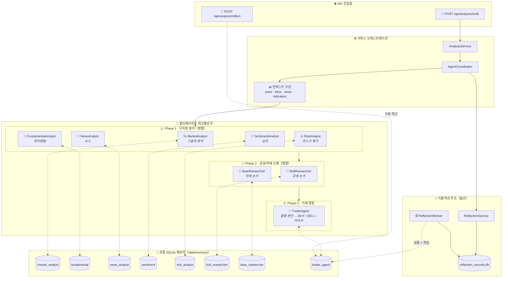

<div align="center">
  <a href="README.md">🇺🇸 English</a> |
  <a href="README_CN.md">🇨🇳 简体中文</a> |
  <a href="README_TW.md">🇹🇼 繁體中文</a> |
  <a href="README_JA.md">🇯🇵 日本語</a> |
  <a href="README_KO.md">🇰🇷 한국어</a>
</div>
<br/>

<div align="center">
  <a href="https://github.com/brokermr810/QuantDinger">
    
  </a>

  <h1 align="center">QuantDinger</h1>

  <h3 align="center">
    차세대 AI 퀀트 트레이딩 플랫폼
  </h3>

  <p align="center">
    <strong>🤖 AI 네이티브 · 🐍 비주얼 파이썬 · 🌍 글로벌 멀티 마켓 · 🔒 프라이버시 우선</strong>
  </p>
  <p align="center">
    <i>AI 코파일럿과 함께하는 구축, 백테스팅 및 트레이딩 플랫폼. PineScript보다 강력하고, SaaS보다 똑똑합니다.</i>
  </p>

  <p align="center">
  <a href="https://www.quantdinger.com"><strong>공식 커뮤니티</strong></a> ·
  <a href="https://ai.quantdinger.com"><strong>라이브 데모</strong></a> ·
  <a href="https://youtu.be/HPTVpqL7knM"><strong>📺 동영상 데모</strong></a> ·
  <a href="CONTRIBUTORS.md"><strong>🌟 참여하기</strong></a>
  </p>

  <p align="center">
    <a href="LICENSE"></a>
    
    
    
    
  </p>

  <p align="center">
    <a href="https://t.me/quantdinger"></a>
    <a href="https://discord.gg/vwJ8zxFh9Q"></a>
    <a href="https://x.com/HenryCryption"></a>
  </p>
</div>

---

## 📖 소개

### QuantDinger란 무엇인가요?

QuantDinger는 **로컬 우선, 프라이버시 우선의 정량 거래 인프라**입니다. 완전히 귀하의 머신에서 실행되며, 전략, 거래 데이터 및 API 키를 완전히 제어할 수 있습니다.

### 왜 로컬 우선인가요?

데이터와 전략을 클라우드에 잠그는 SaaS 플랫폼과 달리, QuantDinger는 로컬에서 실행됩니다. 귀하의 전략, 거래 로그, API 키 및 분석 결과는 모두 귀하의 머신에 저장됩니다. 벤더 잠금 없음, 구독료 없음, 데이터 유출 없음.

### 누구를 위한 것인가요?

QuantDinger는 다음을 위한 사용자를 위해 구축되었습니다:
- 데이터 주권과 프라이버시를 중시하는 트레이더, 연구원 및 엔지니어
- 투명하고 감사 가능한 거래 인프라를 원하는 사람
- 마케팅보다 엔지니어링을 선호하는 사람
- 완전한 워크플로우가 필요한 사람: 데이터, 분석, 백테스팅 및 실행

### 핵심 기능

QuantDinger는 웹에서 금융 정보를 수집하고, 로컬 시장 데이터와 결합하여 분석 보고서를 생성하는 내장 **LLM 기반 멀티 에이전트 리서치 시스템**을 포함합니다. 이것은 전략 개발, 백테스팅 및 실거래 워크플로우와 통합됩니다.

### 핵심 가치

- **🔓 Apache 2.0 오픈소스**: 완전히 허용적이며 상업적으로 친화적입니다. 바이러스성 GPL/AGPL 라이선스와 달리, 코드와 수정 사항을 진정으로 소유할 수 있습니다.
- **🐍 파이썬 네이티브 & 비주얼**: 표준 파이썬으로 지표를 작성(PineScript보다 쉬움)하고 AI의 지원을 받으세요. 차트에서 신호를 직접 시각화하여 "로컬 버전의 TradingView" 경험을 구축하세요.
- **🤖 AI 루프 최적화**: 전략을 실행할 뿐만 아니라, AI가 백테스트 결과를 분석하여 매개변수 조정(손절매/이익실현/MACD 설정)을 제안하고 폐루프 최적화를 형성합니다.
- **🌍 글로벌 마켓 액세스**: 암호화폐(실거래), 미국/중국 주식, 외환 및 선물(데이터/알림)을 지원하는 통합 시스템.
- **⚡ Docker & 클린 아키텍처**: 4줄 명령어로 빠른 배포. 모던 기술 스택(Vue + Python), 클린 아키텍처, 관심사 분리.

---

## 📺 동영상 데모

<div align="center">
  <a href="https://youtu.be/HPTVpqL7knM">
    
  </a>
  <p><strong>위 동영상을 클릭하여 QuantDinger 프로젝트 소개를 시청하세요</strong></p>
</div>

---

## 📚 문서

### 개발 가이드
- [Python 전략 개발 가이드](docs/STRATEGY_DEV_GUIDE_KO.md)
- [Interactive Brokers (IBKR) 트레이딩 가이드](docs/IBKR_TRADING_GUIDE_EN.md) 🆕
- [MetaTrader 5 (MT5) 트레이딩 가이드](docs/MT5_TRADING_GUIDE_EN.md) 🆕

### 알림 설정
- [Telegram 알림 설정](docs/NOTIFICATION_TELEGRAM_CONFIG_EN.md)
- [이메일 (SMTP) 알림 설정](docs/NOTIFICATION_EMAIL_CONFIG_EN.md)
- [SMS (Twilio) 알림 설정](docs/NOTIFICATION_SMS_CONFIG_EN.md)

## 📸 비주얼 투어

<div align="center">
  <h3>📊 전문 퀀트 대시보드</h3>
  <p>시장 역학, 자산 및 전략 상태에 대한 실시간 모니터링.</p>
  
</div>

<br/>

<table align="center" width="100%">
  <tr>
    <td width="50%" align="center" valign="top">
      <h3>🤖 AI 딥 리서치</h3>
      <p>시장 심리 및 기술적 분석을 위한 멀티 에이전트 협업.</p>
      
    </td>
    <td width="50%" align="center" valign="top">
      <h3>💬 스마트 트레이딩 어시스턴트</h3>
      <p>즉각적인 시장 통찰력을 위한 자연어 인터페이스.</p>
      
    </td>
  </tr>
  <tr>
    <td width="50%" align="center" valign="top">
      <h3>📈 대화형 지표 분석</h3>
      <p>드래그 앤 드롭 분석이 가능한 풍부한 기술적 지표 라이브러리.</p>
      
    </td>
    <td width="50%" align="center" valign="top">
      <h3>🐍 Python 전략 생성</h3>
      <p>AI 지원 전략 코딩이 가능한 내장 에디터.</p>
      
    </td>
  </tr>
  <tr>
    <td colspan="2" align="center" valign="top">
      <h3>📊 포트폴리오 모니터</h3>
      <p>포지션 추적, 알림 설정, 이메일/Telegram으로 AI 분석 보고서 수신.</p>
      
    </td>
  </tr>
</table>

---

## ✨ 주요 기능

### 1. 비주얼 파이썬 전략 워크벤치
*PineScript보다 강력하고, SaaS보다 똑똑합니다.*

- **파이썬 네이티브**: 파이썬으로 지표와 전략을 작성하세요. PineScript와 같은 전용 언어 대신 완전한 파이썬 생태계(Pandas, Numpy, TA-Lib)를 활용하세요.
- **"Mini-TradingView" 경험**: 내장된 K-라인 차트에서 파이썬 지표를 직접 실행하세요. 과거 데이터에서 매수/매도 신호를 시각적으로 디버깅하세요.
- **AI 지원 코딩**: 내장 AI가 복잡한 로직을 작성하도록 하세요. 아이디어에서 코드까지 단 몇 초면 됩니다.

### 2. 완전한 거래 라이프사이클
*지표에서 실행까지, 매끄럽게.*

1.  **지표**: 시장 진입/청산 신호를 정의하세요.
2.  **전략 설정**: 위험 관리 규칙(포지션 사이징, 손절매, 이익실현)을 추가하세요.
3.  **백테스트 & AI 최적화**: 백테스트를 실행하고, 풍부한 성과 지표를 확인하며, **AI가 결과를 분석하여 개선 사항을 제안**하도록 하세요(예: "MACD 임계값을 X로 조정").
4.  **실행 모드**:
    - **실거래**:
      - **암호화폐**: 직접 API 실행, 10개 이상의 거래소(Binance, OKX, Bitget, Bybit 등) 지원
      - **미국/홍콩 주식**: Interactive Brokers (IBKR) 경유 🆕
      - **외환**: MetaTrader 5 (MT5) 경유 🆕
    - **신호 알림**: 실거래를 지원하지 않는 시장(A주/선물)의 경우, Telegram, Discord, Email, SMS 또는 Webhook을 통해 신호를 전송하세요.

### 3. AI 멀티 에이전트 리서치
*연중무휴 24시간 AI 투자 위원회.*

시스템은 전략의 2차 필터 역할을 하는 멀티 에이전트 팀을 고용합니다:

- **리서치 에이전트**: 웹 뉴스 및 거시적 이벤트(Google/Bing)를 수집합니다.
- **분석 에이전트**: 기술적 지표 및 자금 흐름을 분석합니다.
- **전략 통합**: AI의 판단을 "시장 필터"로 사용할 수 있습니다. AI의 심리가 일치할 때만 전략 거래를 허용합니다(예: "AI 리스크 분석가가 거시적 리스크가 높다고 판단하면 매수하지 않음").

### 4. 범용 데이터 엔진

QuantDinger는 여러 시장에 걸친 통합 데이터 인터페이스를 제공합니다:

- **암호화폐**: 거래를 위한 직접 API 연결（10개 이상의 거래소）및 시장 데이터를 위한 CCXT 통합（100개 이상의 소스）
- **주식**: Yahoo Finance, Finnhub, Tiingo（미국 주식）및 AkShare（중국/홍콩 주식）
- **선물/외환**: OANDA 및 주요 선물 데이터 소스
- **프록시 지원**: 제한된 네트워크 환경을 위한 내장 프록시 구성

### 5. 🧠 메모리 증강 에이전트(Memory-Augmented Agents)
QuantDinger의 에이전트는 매번 “처음부터” 시작하지 않습니다. 백엔드에는 **로컬 메모리 DB + 리플렉션(검증) 루프**가 내장되어 있어, 과거 경험을 검색해 system prompt에 주입하는 RAG 스타일의 강화가 동작합니다.

- **무엇인가**: 경험 검색 기반 프롬프트 강화(모델 파인튜닝/학습이 아님)
- **저장 위치**: 로컬 SQLite (`backend_api_python/data/memory/`)

#### 흐름도(요청 → 메모리 폐루프)



#### 검색 랭킹(간략)
\[
score = w_{sim}\cdot sim + w_{recency}\cdot recency + w_{returns}\cdot returns\_score
\]

#### 학습 경로
- **수동 회고(추천)**: `POST /api/analysis/reflect`로 실제 결과(returns/result)를 메모리에 기록
- **자동 검증(옵션)**: `ENABLE_REFLECTION_WORKER=true`, `REFLECTION_WORKER_INTERVAL_SEC`로 주기적 검증→메모리 반영

#### 주요 환경 변수(`.env`)
- `ENABLE_AGENT_MEMORY`, `AGENT_MEMORY_TOP_K`, `AGENT_MEMORY_CANDIDATE_LIMIT`
- `AGENT_MEMORY_ENABLE_VECTOR`, `AGENT_MEMORY_EMBEDDING_DIM`
- `AGENT_MEMORY_HALF_LIFE_DAYS`, `AGENT_MEMORY_W_SIM`, `AGENT_MEMORY_W_RECENCY`, `AGENT_MEMORY_W_RETURNS`
- `ENABLE_REFLECTION_WORKER`, `REFLECTION_WORKER_INTERVAL_SEC`

### 6. 전략 런타임

- **스레드 기반 실행기**: 전략 실행을 위한 독립적인 스레드 풀
- **자동 복구**: 시스템 재시작 후 실행 중인 전략 재개
- **주문 대기열**: 주문 실행을 위한 백그라운드 워커

### 7. 기술 스택

- **백엔드**: Python (Flask) + SQLite + Redis（옵션）
- **프론트엔드**: Vue 2 + Ant Design Vue + KlineCharts/ECharts
- **배포**: Docker Compose

---

## 🔌 지원되는 거래소 및 브로커

QuantDinger는 다양한 시장 유형에 대해 여러 실행 방법을 지원합니다:

### 암호화폐 거래소(직접 API)

| 거래소 | 시장 |
|:--------:|:---------|
| Binance | 현물, 선물, 마진 |
| OKX | 현물, 무기한, 옵션 |
| Bitget | 현물, 선물, 카피 트레이딩 |
| Bybit | 현물, 선형 선물 |
| Coinbase Exchange | 현물 |
| Kraken | 현물, 선물 |
| KuCoin | 현물, 선물 |
| Gate.io | 현물, 선물 |
| Bitfinex | 현물, 파생상품 |

### 전통적인 브로커

| 브로커 | 시장 | 플랫폼 |
|:------:|:--------|:---------|
| **Interactive Brokers (IBKR)** | 미국 주식, 홍콩 주식 | TWS / IB Gateway 🆕 |
| **MetaTrader 5 (MT5)** | 외환 | MT5 터미널 🆕 |

### 시장 데이터(CCXT 경유)

Bybit, Gate.io, Kraken, KuCoin, HTX 및 100개 이상의 기타 거래소가 시장 데이터용으로 지원됩니다.

---

### 다국어 지원

QuantDinger는 포괄적인 국제화를 통해 글로벌 사용자를 위해 구축되었습니다:

<p>
  
  
  
  
  
  
  
  
  
  
</p>

모든 UI 요소, 오류 메시지 및 문서는 완벽하게 번역되어 있습니다. 언어는 브라우저 설정에 따라 자동으로 감지되거나 앱에서 수동으로 전환할 수 있습니다.

---

### 지원되는 시장

| 시장 유형 | 데이터 소스 | 거래 |
|-------------|--------------|---------|
| **암호화폐** | Binance, OKX, Bitget, + 100 거래소 | ✅ 완전 지원 |
| **미국 주식** | Yahoo Finance, Finnhub, Tiingo | ✅ IBKR 경유 🆕 |
| **홍콩 주식** | AkShare, East Money | ✅ IBKR 경유 🆕 |
| **중국 주식(A주)** | AkShare, East Money | ⚡ 데이터만 |
| **외환** | Finnhub, OANDA | ✅ MT5 경유 🆕 |
| **선물** | 거래소 API, AkShare | ⚡ 데이터만 |

---

### 아키텍처 (현재 레포지토리)

```text
┌─────────────────────────────┐
│      quantdinger_vue         │
│   (Vue 2 + Ant Design Vue)   │
└──────────────┬──────────────┘
               │  HTTP (/api/*)
               ▼
┌─────────────────────────────┐
│     backend_api_python       │
│   (Flask + 전략 런타임)      │
└──────────────┬──────────────┘
               │
               ├─ SQLite (quantdinger.db)
               ├─ Redis (옵션 캐시)
               └─ 데이터 제공자 / LLMs / 거래소
```

---

### 레포지토리 구조

```text
.
├─ backend_api_python/         # Flask API + AI + 백테스트 + 전략 런타임
│  ├─ app/
│  ├─ env.example              # 로컬 구성을 위해 .env로 복사
│  ├─ requirements.txt
│  └─ run.py                   # 엔트리 포인트
└─ quantdinger_vue/            # Vue 2 UI (개발 서버는 /api를 백엔드로 프록시)
```

---

## 빠른 시작

### 옵션 1: Docker 배포 (권장)

QuantDinger를 실행하는 가장 빠른 방법입니다.

#### 1. 원클릭 시작

**Linux / macOS**
```bash
git clone https://github.com/brokermr810/QuantDinger.git && \
cd QuantDinger && \
cp backend_api_python/env.example backend_api_python/.env && \
docker-compose up -d --build
```

**Windows (PowerShell)**
```powershell
git clone https://github.com/brokermr810/QuantDinger.git
cd QuantDinger
Copy-Item backend_api_python\env.example -Destination backend_api_python\.env
docker-compose up -d --build
```

#### 2. 접속 및 구성

- **프론트엔드 UI**: http://localhost:8888
- **기본 계정**: `quantdinger` / `123456`

> **참고**: AI 기능이나 프로덕션 환경의 보안을 위해, `backend_api_python/.env`를 편집하여( `OPENROUTER_API_KEY` 추가, 비밀번호 변경) `docker-compose restart backend`로 서비스를 재시작하십시오.

#### 3. 애플리케이션 액세스

- **프론트엔드 UI**: http://localhost
- **백엔드 API**: http://localhost:5000

#### Docker 명령 참조

```bash
# 실행 상태 보기
docker-compose ps

# 로그 보기
docker-compose logs -f

# 서비스 중지
docker-compose down

# 볼륨 중지 및 제거 (경고: 데이터베이스가 삭제됩니다!)
docker-compose down -v
```

#### 데이터 지속성

다음 데이터는 호스트에 마운트되며 컨테이너 재시작 후에도 유지됩니다:

```yaml
volumes:
  - ./backend_api_python/logs:/app/logs                       # 로그
  - ./backend_api_python/data:/app/data                       # 데이터 디렉토리(quantdinger.db 포함)
  - ./backend_api_python/.env:/app/.env                       # 구성 파일
```

---

### 옵션 2: 로컬 개발

**전제 조건**
- Python 3.10+ 권장
- Node.js 16+ 권장

#### 1. 백엔드 시작 (Flask API)

```bash
cd backend_api_python
pip install -r requirements.txt
cp env.example .env   # Windows: copy env.example .env
python run.py
```

백엔드는 `http://localhost:5000`에서 사용할 수 있습니다.

#### 2. 프론트엔드 시작 (Vue UI)

```bash
cd quantdinger_vue
npm install
npm run serve
```

프론트엔드 개발 서버는 `http://localhost:8000`에서 실행되며 `/api/*`를 `http://localhost:5000`으로 프록시합니다.

---

### 구성 (.env)

`backend_api_python/env.example`을 템플릿으로 사용하십시오. 일반적인 설정은 다음과 같습니다:

- **인증**: `SECRET_KEY`, `ADMIN_USER`, `ADMIN_PASSWORD`
- **서버**: `PYTHON_API_HOST`, `PYTHON_API_PORT`, `PYTHON_API_DEBUG`
- **AI / LLM**: `OPENROUTER_API_KEY`, `OPENROUTER_MODEL`
- **웹 검색**: `SEARCH_PROVIDER`, `SEARCH_GOOGLE_*`, `SEARCH_BING_API_KEY`
- **프록시 (옵션)**: `PROXY_PORT` 또는 `PROXY_URL`

---

## 🤝 커뮤니티 및 지원

- **기여**: [기여 가이드](CONTRIBUTING.md) · [기여자](CONTRIBUTORS.md)
- **Telegram**: [QuantDinger 그룹](https://t.me/quantdinger)
- **Discord**: [서버 참여](https://discord.gg/vwJ8zxFh9Q)
- **📺 동영상 데모**: [프로젝트 소개](https://youtu.be/HPTVpqL7knM)
- **YouTube**: [@quantdinger](https://youtube.com/@quantdinger)
- **Email**: [brokermr810@gmail.com](mailto:brokermr810@gmail.com)
- **GitHub Issues**: [버그 신고 / 기능 요청](https://github.com/brokermr810/QuantDinger/issues)

---

## 💰 프로젝트 지속 가능성

QuantDinger는 오픈소스이며 무료로 사용할 수 있습니다. 유용하다고 생각되면 다음은 지속적인 개발을 지원하는 방법입니다:

### 직접 기부

**ERC-20 / BEP-20 / Polygon / Arbitrum**
```
0x96fa4962181bea077f8c7240efe46afbe73641a7
```


### 거래소 추천 링크

지원되는 거래소에 가입하는 경우, 아래 링크를 사용하면 추천 혜택이 제공되어 프로젝트 지원에 도움이 됩니다. 이는 선택 사항이며 거래 수수료나 계정 기능에 영향을 주지 않습니다.

| 거래소 | 추천 링크 |
|:--------:|:-------------|
| Binance | [추천 링크로 가입](https://www.bmwweb.ac/referral/earn-together/refer2earn-usdc/claim?hl=zh-CN&ref=GRO_28502_9OSOJ) |
| OKX | [추천 링크로 가입](https://www.bjwebptyiou.com/join/14449926) |
| Bitget | [추천 링크로 가입](https://share.glassgs.com/u/H8XZGS71) |

---

### 상용 서비스

다음 전문 서비스를 제공합니다:

| 서비스 | 설명 |
|---------|-------------|
| **배포 및 설정** | 서버 배포, 구성 및 최적화에 대한 일대일 지원 |
| **맞춤형 전략 개발** | 귀하의 특정 요구와 시장에 맞춘 거래 전략 설계 |
| **엔터프라이즈 업그레이드** | 상용 라이선스, 우선 지원 및 비즈니스를 위한 고급 기능 |
| **교육 및 컨설팅** | 거래 팀을 위한 실전 교육 세션 및 전략 컨설팅 |

**관심이 있으십니까?** 다음을 통해 문의하십시오:
- 📧 Email: [brokermr810@gmail.com](mailto:brokermr810@gmail.com)
- 💬 Telegram: [QuantDinger Group](https://t.me/quantdinger)

---

### 감사의 말

QuantDinger는 Flask, Pandas, CCXT, Vue.js, Ant Design Vue, KlineCharts 등과 같은 훌륭한 오픈 소스 프로젝트의 어깨 위에 서 있습니다.

모든 관리자와 기여자에게 감사드립니다! ❤️

